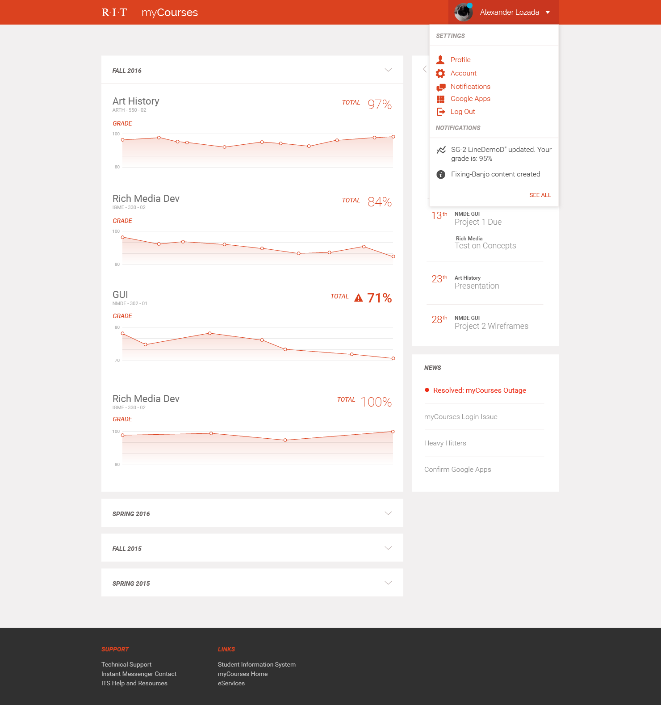

jnote 
======

A simple, extremely lightweight, responsive javascript image-annotation system.

What does it do?
======

jnote provides a way to annotate images using the mouse and html5 canvas.  When a user hovers over an image hotspot, a caption will appear.

I made this because all current solutions are bloated and / or very unattractive.  jnote is extremely light (with no dependencies) and incredibly easy to style.

Status
======
jnote hasn't been thoroughly tested, but it seems to work on all recent major browsers.

How do I use it?
======

jnote requires no dependencies.  Simply download the `jnote.js` and `jnote.css` files (the two in the `src` folder) and reference them in your project.
At the bottom of the body of your HTML, initialize jnote with the following:

```html
<script>jnote.init();</script>
```

To annotate images, you'll need an `` tag.  Images are described using json in the `data-jnote` data attribute.
You also need to assign the image a class of `jnote`.
```html

```

> This is a rather unconventional way of doing things, and I'm unsure about support for older browsers.  Other
methods will be available in the future.

> Note that the `x` and `y` coordinates refer to the percentage of the image - a value of `1` is the full
height or width of the image, and `0.5` is half that.

Styles
======
jnote can be easily styled with common CSS and some JS.

##### Changing the annotation window style

```css
.jnote-window{
    background: green;
}
```

##### Changing default settings

```js
jnote.settings.radius = 7; // size of dot on image
jnote.settings.hoverPadding = 10; // adds padding to dot so caption will appear even when user isn't completely accurate
jnote.settings.color = "green"; // sets the color for the dot
```


Examples
======
In this repo is an `index.html` file, along with an image that will get you started!

License
======
BSD 3